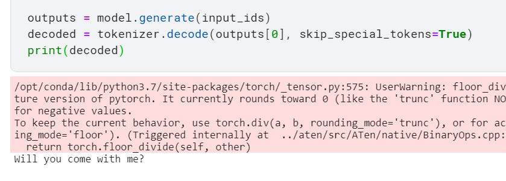

# Researching on machine learning solutions 
# for Chinese translation

https://anno-ai.medium.com/neural-machine-translation-with-hugging-faces-transformers-library-eb3bcce93298

MarianMT: MarianMT is a fast translation framework written in C++ and is primarily maintained by the Microsoft Translator team. This is also the NMT engine that’s used under the hood for Microsoft’s Neural Machine Translation service.

OpenNMT: The Harvard NLP team originally developed OpenNMT, and it is now primarily maintained by SYSTRAN.

Sockeye: Sockeye is a sequence-to-sequence framework for neural machine translation; it’s used under the hood by Amazon Translate.

Fairseq: Fairseq is Facebook’s sequence modeling toolkit that allows researchers and developers to train custom models for translation, summarization, language modeling and other text generation tasks. It provides reference implementations and pre-trained models associated with many recent NMT research articles.

Hugging Face Transformers: The Transformers library provides general-purpose architectures for translation as well as a range of other language modeling and text generation tasks. It also enables contributors to publish language datasets and share trained models.

I think hugging face is the best way forward

https://huggingface.co/transformers/main_classes/model.html

Hugging face provided an off the shelf solution for the model translation

https://www.kaggle.com/fanbyprinciple/hugging-face-chinese-translation-example/edit

limited success

